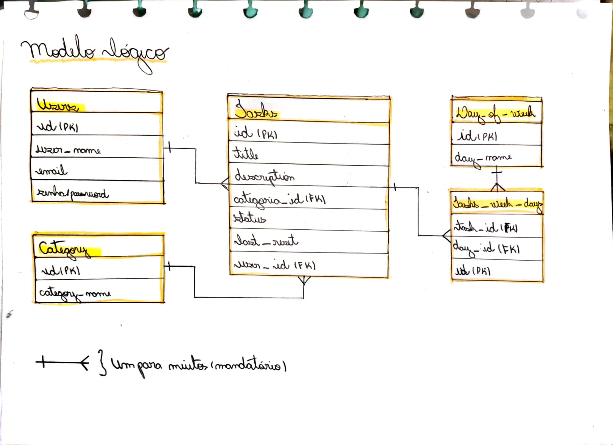
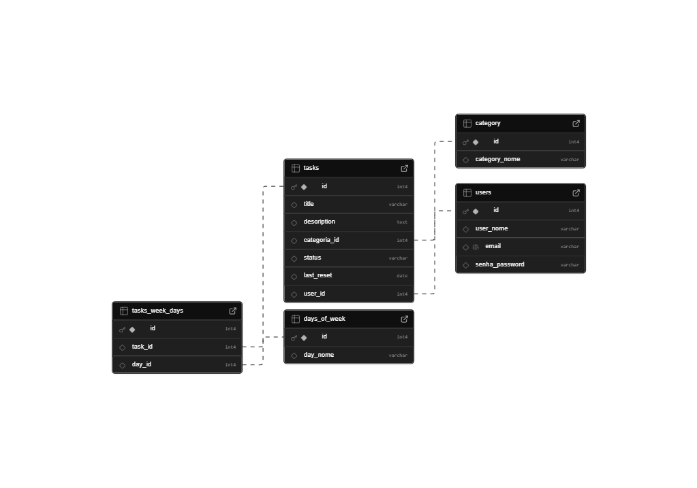
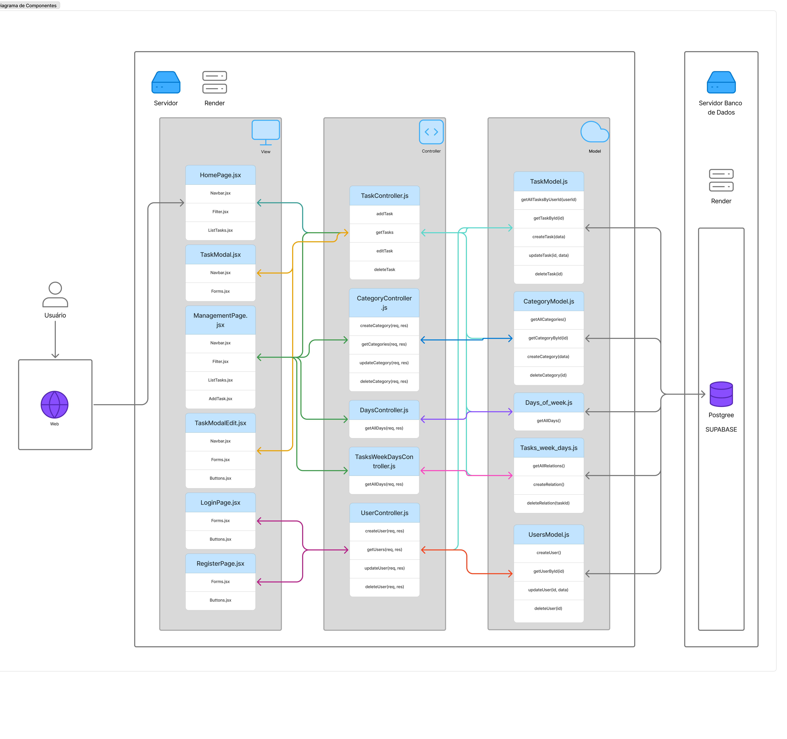
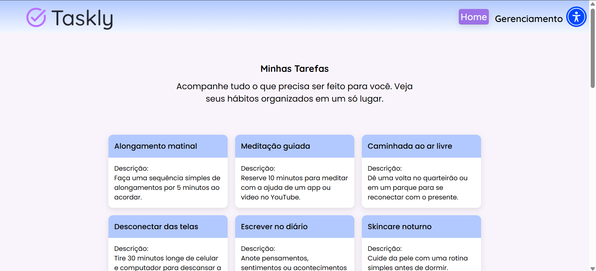
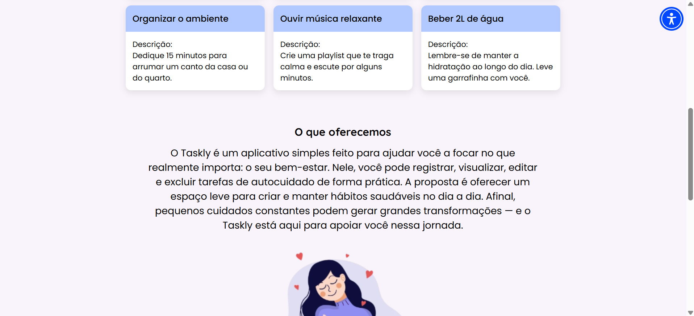
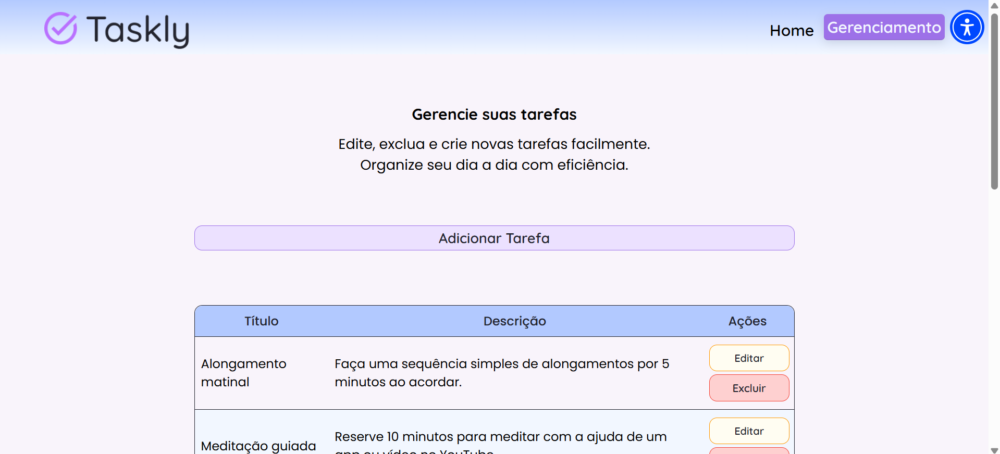
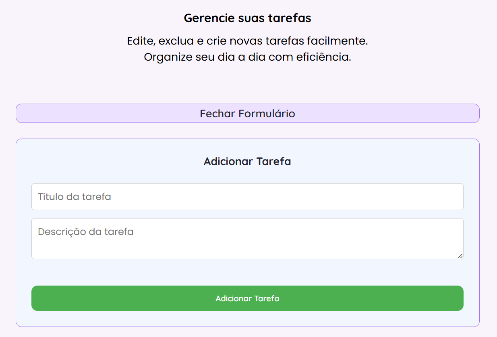
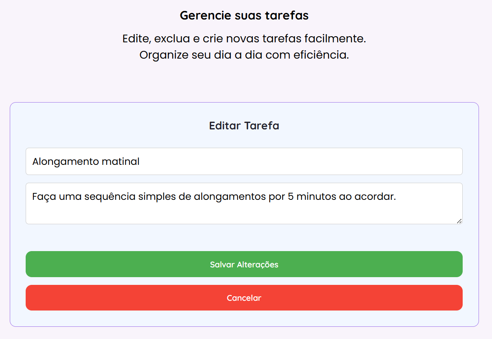
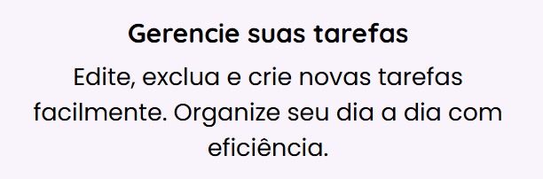

# Web Application Document - Projeto Individual - Módulo 2 - Inteli

## Taskly

#### Giovanna Neves Rodrigues

## Sumário

1. [Introdução](#c1)
2. [Visão Geral da Aplicação Web](#c2)
3. [Projeto Técnico da Aplicação Web](#c3)
4. [Desenvolvimento da Aplicação Web](#c4)
5. [Referências](#c5)

<br>

## <a name="c1"></a>1. Introdução

O WAD (Website Analysis Document) é o documento central de uma aplicação web. Ele tem como objetivo detalhar o funcionamento, desenvolvimento e principais aspectos técnicos de um software web. Neste documento, serão apresentadas as principais características e decisões do Taskly, incluindo a lógica de funcionamento, arquitetura e componentes utilizados.

Dados recentes indicam que distúrbios e doenças mentais afetam desproporcionalmente as mulheres, em grande parte devido à sobrecarga histórica de responsabilidades sociais e familiares. Essa realidade muitas vezes leva à negligência do autocuidado e compromete a saúde mental.

Pensando nisso, nasceu o Taskly, uma solução desenvolvida para ajudar mulheres a organizarem seus hábitos e tarefas de autocuidado de forma objetiva e intuitiva, promovendo bem-estar físico e mental. O sistema permite o acompanhamento regular dessas tarefas, criando uma estrutura que incentiva a prática constante do autocuidado, mesmo diante de uma rotina exigente.

De forma prática, o sistema é uma interface simples de tarefas que permite criar, visualizar, editar e excluir atividades de autocuidado. Atualmente, não há marcação de conclusão nem categorização, mas o foco está em oferecer uma ferramenta leve para registrar tarefas com título e descrição. As atividades podem ser atualizadas conforme a necessidade, funcionando como um apoio básico à organização pessoal e à construção de hábitos saudáveis.

## <a name="c2"></a>2. Visão Geral da Aplicação Web

### 2.1. Personas

A entrega em questão não contemplou esse item.

### 2.2. User Stories

A entrega em questão não contemplou esse item.

---

## <a name="c3"></a>3. Projeto da Aplicação Web

### 3.1. Modelagem do banco de dados

O diagrama de banco de dados é uma ferramenta essencial na elaboração de qualquer sistema. Ele não apenas auxilia na demonstração do funcionamento e lógica que os dados devem seguir, mas também traduz essas informações para os desenvolvedores, criando clareza nos fluxos de dados. Dessa forma, torna-se um elemento indispensável no planejamento do software.

O projeto em questão apresenta dois principais modelos de banco de dados: o modelo lógico e o modelo físico.

O modelo lógico tem como objetivo fornecer uma visão geral dos processos operacionais ou transacionais, apresentando as entidades e suas relações de maneira abstrata. Já o modelo físico é mais detalhado, oferecendo informações que ajudam os administradores e desenvolvedores a implementar a lógica de negócios em um banco de dados real.

**Modelo Lógico** <br>
Abaixo, é possível observar o diagrama lógico:

<div align="center"> <sub>Figura 1 - Modelo Lógico de Banco de Dados</sub>  <sup>Fonte: Material produzido pela autora (2025)</sup> </div>
Este diagrama lógico inclui cinco principais entidades/tabelas: users, tasks, category, day_of_week e tasks_week_days. Ele explicita de forma clara os principais "objetos" e seus relacionamentos no sistema, como a tabela users, que controla o login dos usuários, e as tabelas restantes, que gerenciam as tarefas. Além disso, cada relação entre tabelas é marcada por linhas, com símbolos que representam relações "um para muitos". Embora o modelo aparente simplicidade, suas regras de negócio trazem um grau considerável de complexidade.<br>
<br>

Embora o modelo represente uma estrutura robusta, com lógica de recorrência e categorização, o MVP atual opera com uma estrutura mais simples, suficiente para gerenciar tarefas básicas. A ideia é que esse modelo mais completo seja implementado em versões futuras, conforme a aplicação evoluir e novas funcionalidades forem incorporadas.
<br>

**Modelo Físico** <br>
Agora, é possível observar o diagrama físico:

<div align="center"> <sub>Figura 2 - Modelo Físico Representado</sub>  <sup>Fonte: Material produzido pela autora através da plataforma Supabase (2025)</sup> </div>

O modelo físico foi gerado diretamente na plataforma Supabase, refletindo a estrutura real do banco de dados utilizado. Ele mantém as mesmas entidades e regras descritas no modelo lógico, mas com detalhes adicionais que facilitam a implementação do sistema. Abaixo há os esquemas do Banco de dados:

**Script de Criação**

```sql
-- Tabela de usuários (V2.0)
CREATE TABLE IF NOT EXISTS users (
    id INT PRIMARY KEY,
    user_nome VARCHAR(100),
    email VARCHAR(100) UNIQUE,
    senha_password VARCHAR(100)
);

-- Tabela de categorias (V2.0)
CREATE TABLE IF NOT EXISTS category (
    id INT PRIMARY KEY,
    category_nome VARCHAR(100)
);

-- Tabela de tarefas
CREATE TABLE IF NOT EXISTS tasks (
    id INT PRIMARY KEY,
    title VARCHAR(200),
    description TEXT,
    categoria_id INT, -- ID da categoria (V2.0)
    status VARCHAR(50), -- Status da tarefa (ex: "pendente", "concluída", etc.) (V2.0)
    last_reset DATE, -- Data do último reset (V2.0)
    user_id INT, -- ID do usuário que criou a tarefa (V2.0)
    FOREIGN KEY (categoria_id) REFERENCES category(id), -- Chave estrangeira para a tabela de categorias (V2.0)
    FOREIGN KEY (user_id) REFERENCES users(id) -- Chave estrangeira para a tabela de usuários (V2.0)
);

-- Tabela dos dias da semana (V2.0)
CREATE TABLE IF NOT EXISTS days_of_week (
    id INT PRIMARY KEY,
    day_nome VARCHAR(20)
);

-- Tabela de associação entre tarefas e dias da semana (V2.0)
CREATE TABLE IF NOT EXISTS tasks_week_days (
    id INT PRIMARY KEY,
    task_id INT,
    day_id INT,
    FOREIGN KEY (task_id) REFERENCES tasks(id),
    FOREIGN KEY (day_id) REFERENCES days_of_week(id)
);

```

**Script de Inserção**

```sql
-- Inserir os dias da semana
INSERT INTO days_of_week (id, day_nome) VALUES (1, 'Segunda');
INSERT INTO days_of_week (id, day_nome) VALUES (2, 'Terça');
INSERT INTO days_of_week (id, day_nome) VALUES (3, 'Quarta');
INSERT INTO days_of_week (id, day_nome) VALUES (4, 'Quinta');
INSERT INTO days_of_week (id, day_nome) VALUES (5, 'Sexta');
INSERT INTO days_of_week (id, day_nome) VALUES (6, 'Sábado');
INSERT INTO days_of_week (id, day_nome) VALUES (7, 'Domingo');

-- Inserir uma usuária
INSERT INTO users (id, user_nome, email, senha_password)
VALUES (1, 'Maria Oliveira', 'maria@example.com', 'senhaSegura123');

-- Inserir uma categoria "Saúde"
INSERT INTO category (id, category_nome)
VALUES (1, 'Saúde');

-- Inserir uma tarefa associada à usuária e à categoria
INSERT INTO tasks (id, title, description, categoria_id, status, last_reset, user_id)
VALUES (1, 'Caminhada matinal', 'Caminhar 30 minutos pela manhã', 1, 'pendente', '2025-05-09', 1);

-- Associar essa tarefa à segunda-feira
INSERT INTO tasks_week_days (id, task_id, day_id)
VALUES (1, 1, 1);

```

Dessa forma, é possível perceber que, mesmo com um número relativamente pequeno de tabelas, a modelagem do banco de dados do Taskly apresenta uma complexidade de entendimento significativa. Tudo isso, busca emplementar uma arquitetura que prioriza a eficiência no manejo dos dados, visando sempre o melhor uso possível.

### 3.1.1 BD e Models

O Banco de Dados é responsável por armazenar todas as informações da aplicação de forma organizada. Já os Models são responsáveis por se comunicar com esse banco, realizando operações como criar, buscar, atualizar e excluir dados. Essa separação ajuda a manter o sistema mais organizado e fácil de manter. Abaixo há uma descrição do funcionamento do models principal do sistema

```javascript
// OBS: alguns dados da tarefa entram como NULL nessa primeira versão, pois não há validação de entrada. Em uma versão futura, deve-se adicionar validações para garantir que os dados sejam válidos antes de inserir ou atualizar no banco de dados.

// models/taskModel.js
const db = require("../config/db");

// Listar todas as tarefas
async function getAllTasks() {
  const result = await db.query("SELECT * FROM tasks");
  return result.rows;
}

// Criar uma nova tarefa
async function createTask({
  title,
  description,
  categoria_id,
  status,
  last_reset,
  user_id,
}) {
  const query = `
    INSERT INTO tasks (title, description, categoria_id, status, last_reset, user_id)
    VALUES ($1, $2, $3, $4, $5, $6)
    RETURNING *;
  `;
  const values = [
    title,
    description,
    categoria_id,
    status,
    last_reset,
    user_id,
  ];
  const result = await db.query(query, values);
  return result.rows[0];
}

// Editar uma tarefa
async function updateTask(
  id,
  { title, description, categoria_id, status, last_reset, user_id }
) {
  const query = `
    UPDATE tasks
    SET title = $1, description = $2, categoria_id = $3, status = $4, last_reset = $5, user_id = $6
    WHERE id = $7
    RETURNING *;
  `;
  const values = [
    title,
    description,
    categoria_id,
    status,
    last_reset,
    user_id,
    id,
  ];
  const result = await db.query(query, values);
  return result.rows[0];
}

// Excluir uma tarefa
async function deleteTask(id) {
  const result = await db.query("DELETE FROM tasks WHERE id = $1 RETURNING *", [
    id,
  ]);
  return result.rows[0];
}

module.exports = {
  getAllTasks,
  createTask,
  updateTask,
  deleteTask,
};
```

O sistema implementa um modelo principal responsável pela manipulação de dados relacionados às tarefas, localizado no arquivo taskModel.js. Este model realiza operações básicas de acesso e persistência de dados utilizando comandos SQL executados por meio de uma conexão estabelecida com o banco de dados PostgreSQL, através do supabase, configurada no módulo db. Todas as funções são assíncronas e seguem o padrão CRUD (Create, Read, Update, Delete), permitindo listar, criar, editar e excluir tarefas.

A função getAllTasks realiza a listagem completa das tarefas cadastradas no sistema, executando uma consulta SQL simples que retorna todas as linhas da tabela tasks. Para a criação de novas tarefas, utiliza-se a função createTask, que recebe um objeto contendo os campos title, description, categoria_id, status, last_reset e user_id. Esses dados são inseridos na tabela por meio de um comando INSERT, e a tarefa recém-criada é retornada com todos os seus campos.

A edição de tarefas é feita pela função updateTask, que recebe o id da tarefa a ser alterada e um objeto com os novos valores para os mesmos campos utilizados na criação. A operação é realizada com um comando UPDATE, e a tarefa atualizada é retornada. Já a exclusão de tarefas é tratada pela função deleteTask, que executa um comando DELETE com base no id da tarefa e retorna os dados da tarefa removida.

Nesta versão inicial do sistema, ainda não há validações de entrada para garantir a integridade dos dados fornecidos pelo usuário, o que permite que alguns campos, como categoria_id e last_reset, sejam inseridos com valor NULL. Em versões futuras, pretende-se incluir camadas de validação para assegurar que todos os dados inseridos ou atualizados no banco sejam válidos e consistentes com as regras de negócio do sistema.

### 3.2. Arquitetura

A arquitetura de software define como os diferentes componentes de um sistema estão organizados e se comunicam. O sistema apresentado segue o padrão de arquitetura MVC (Model-View-Controller), separando a aplicação em três camadas principais: View (interface do usuário), Controller (lógica de controle) e Model (acesso e manipulação dos dados). A seguir, detalha-se o fluxo de dados entre essas camadas:

<div align="center">
<sub>Figura 3 - Diagrama de componentes V2.0</sub>

<sup>Fonte: Material produzido pelos autores (2025)</sup>
</div>

1. **Interação do Usuário com a View**
   O fluxo se inicia quando o usuário interage com a interface gráfica da aplicação (View), composta futuramente por arquivos como LoginPage.jsx, HomePage.jsx, TaskModal.jsx e outros componentes React. Essas páginas capturam ações do usuário, como cliques em botões, envios de formulários ou preenchimento de campos.

2. **Envio de Requisições para o Controller**
   Ao ocorrer uma interação, a View envia uma requisição para a camada de Controller correspondente. Por exemplo, quando o usuário acessa, é criada uma chamada para o controller pegar todas as tarefas criadas no sistema.

3. **Processamento da Requisição pelo Controller**
   O Controller atua como intermediador entre a View e o Model. Ele recebe os dados enviados pela interface, realiza validações e processa a lógica de negócio necessária. Se for preciso acessar ou modificar dados, o Controller aciona o Model correspondente.

4. **Acesso ao Banco de Dados via Model**
   O Model é responsável por interagir diretamente com o banco de dados. Ele executa comandos de leitura, inserção, atualização ou exclusão de dados. Por exemplo,os Models como TaskModel.js, CategoryModel.js, UsersModel.js, entre outros, contêm métodos como getTasks(), insertUser(), deleteTask() que atuam acessando e modificando o banco.

5. **Retorno dos Dados**
   Após a execução da operação no banco de dados, o Model retorna os dados para o Controller, que os trata, quando necessário, e os envia de volta para a View. A resposta inclui dados como listas de tarefas e futuramente categorias, dias da semana, etc.

6. **Atualização da Interface**
   Por fim, a View recebe os dados retornados do Controller e os utiliza para atualizar a interface apresentada ao usuário, garantindo uma experiência interativa e dinâmica.

**OBS:** É válido mencionar que alguns arquivos não são listados no diagrama, mas contribuem diretamente para o sistema, como script inicial "server.js" e os arquivos de rotas, representados no sistema por "/routes/index.js".

### 3.3. Wireframes

A entrega em questão não contemplou esse item.

### 3.4. Guia de estilos

A entrega em questão não contemplou esse item.

### 3.5. Protótipo de alta fidelidade

A entrega em questão não contemplou esse item.

### 3.6. WebAPI e endpoints

Uma Web API (Interface de Programação de Aplicações para a Web) é um conjunto de regras que possibilita a comunicação de diferentes sistemas pela internet, trocando dados de forma estruturada. Ela funciona como uma ponte entre o frontend (interface que o usuário vê) e o backend (servidor que processa dados e lógica).

Já os endpoints são URLs específicas da API que permitem realizar operações, como criar, ler, atualizar ou deletar informações. Cada endpoint responde a requisições HTTP (GET, POST, PUT, DELETE) e executa ações específicas dentro do sistema. Abaixo há uma apresentação dos principais endpoints disponíveis na API do Taskly para gerenciar as tarefas de autocuidado.

### GET /tasks

**Descrição:**  
Retorna a lista de todas as tarefas registradas.

**Exemplo de uso com Fetch:**

```javascript
const resposta = await fetch("/tasks");
const tasks = await resposta.json();
```

**Resposta esperada:**

```json
[
  {
    "id": 1,
    "title": "Beber água",
    "description": "Tomar 2 litros ao longo do dia"
  },
  {
    "id": 2,
    "title": "Exercício físico",
    "description": "Fazer caminhada por 30 minutos"
  }
]
```

**Códigos de resposta:**

- `200 OK` – Tarefas carregadas com sucesso
- `500 Internal Server Error` – Erro ao buscar tarefas

---

### DELETE /tasks/\:id

**Descrição:**
Exclui uma tarefa específica com base no ID informado.

**Exemplo de uso com Fetch:**

```javascript
try {
  const res = await fetch(`/tasks/${id}`, {
    method: "DELETE",
  });

  if (!res.ok) throw new Error("Erro ao excluir tarefa");
} catch (err) {
  console.error(err);
  alert(err.message);
}
```

**Códigos de resposta:**

- `200 OK` – Tarefa excluída com sucesso
- `404 Not Found` – Tarefa não encontrada
- `500 Internal Server Error` – Erro ao excluir tarefa

---

### PUT /tasks/\:id

**Descrição:**
Atualiza o título e a descrição de uma tarefa existente.

**Exemplo de uso com Fetch:**

```javascript
const response = await fetch(`/tasks/${id}`, {
  method: "PUT",
  headers: { "Content-Type": "application/json" },
  body: JSON.stringify({ title, description }),
});
```

**Requisição esperada:**

```json
{
  "title": "Novo título",
  "description": "Nova descrição"
}
```

**Resposta esperada:**

```json
{
  "id": 1,
  "title": "Novo título",
  "description": "Nova descrição"
}
```

**Códigos de resposta:**

- `200 OK` – Tarefa atualizada
- `400 Bad Request` – Dados inválidos
- `404 Not Found` – Tarefa não encontrada
- `500 Internal Server Error` – Erro ao atualizar tarefa

---

### POST /tasks/add

**Descrição:**
Cria uma nova tarefa com título e descrição.

**Exemplo de uso com Fetch:**

```javascript
const response = await fetch("/tasks/add", {
  method: "POST",
  headers: { "Content-Type": "application/json" },
  body: JSON.stringify({ title, description }),
});
```

**Requisição esperada:**

```json
{
  "title": "Ler um livro",
  "description": "Ler 10 páginas antes de dormir"
}
```

**Resposta esperada:**

```json
{
  "id": 3,
  "title": "Ler um livro",
  "description": "Ler 10 páginas antes de dormir"
}
```

**Códigos de resposta:**

- `201 Created` – Tarefa criada com sucesso
- `400 Bad Request` – Campos obrigatórios ausentes
- `500 Internal Server Error` – Erro ao criar tarefa

Dessa maneira, é possível observar como o sistema se comunica com os arquivos do servidor de forma clara e estruturada.

### 3.7 Interface e Navegação

A interface de um sistema é o conjunto de elementos visuais que o usuário utiliza para compreender as informações apresentadas e se comunicar com o sistema. Ela funciona como uma porta de entrada, definindo como o usuário irá interagir e navegar pelas funcionalidades oferecidas. Por isso, é de extrema importância que a interface seja clara, intuitiva e agradável visualmente. Abaixo há uma visualização dos principais elementos que se repetem:

- Menu de navegação superior: permite a navegação entre as telas do sistema
<div align="center">
<sub>Figura 4 - Visual do menu de navegação (navbar)</sub>

<sup>Fonte: Material produzido pelos autores (2025)</sup>
</div>

- Rodapé (vazio): funcionando apenas como indício do fim da página
<div align="center">
<sub>Figura 5 - Visual do menu de navegação (navbar)</sub>

<sup>Fonte: Material produzido pelos autores (2025)</sup>
</div>

É válido ressaltar que o sistema foi estruturado em duas interfaces principais:

1. Tela de entrada (home): Apresenta as principais tasks, além de algumas informações introdutórias sobre o sistema.

<div align="center">
<sub>Figura 6 - Visual da Tela Home</sub>

<sup>Fonte: Material produzido pelos autores (2025)</sup>
</div>

<div align="center">
<sub>Figura 7 - Visual com scrool da Tela Home</sub>

<sup>Fonte: Material produzido pelos autores (2025)</sup>
</div>

2. Tela de gerenciamento: Permite ao usuário criar novas tasks, editar as já existentes ou excluí-las.

<div align="center">
<sub>Figura 8- Visual da Tela de Gerenciamento</sub>

<sup>Fonte: Material produzido pelos autores (2025)</sup>
</div>

A tela de gerenciamento conta com uma espécie de modal, que é exibido sempre que o usuário deseja adicionar ou editar uma task. Esse modal surge sobre a interface principal, permitindo que o usuário foque apenas na ação desejada sem distrações, mantendo o contexto da tela de fundo.

1. Modal de Adição: painél para inserir as informações de novas tarefas.

<div align="center">
<sub>Figura 9 - Modal de Adição</sub>

<sup>Fonte: Material produzido pelos autores (2025)</sup>
</div>

2. Modal de Edição: painél para editar as informações de tarefas já criadas.

<div align="center">
<sub>Figura 10 - Modal de edição</sub>

<sup>Fonte: Material produzido pelos autores (2025)</sup>
</div>

Ambas utilizam cores suaves, com destaque para tons de lilás, cor fortemente associada à espiritualidade e à conexão interior. Os elementos visuais possuem bordas arredondadas, o que transmite uma sensação de suavidade e acolhimento.

As fontes escolhidas foram a Poppins e a Quicksand, que possuem traços simples e arredondados, contribuindo para a facilidade de leitura e para uma estética harmoniosa.

<div align="center">
<sub>Figura 11 - Utilização das Fontes</sub>

<sup>Fonte: Material produzido pelos autores (2025)</sup>
</div>

Além disso, foi integrada uma API de acessibilidade, permitindo que o conteúdo se adapte a diferentes perfis de usuário, promovendo a inclusão digital.

<div align="center">
<sub>Figura 12 - Ícone de Acessibilidade</sub>

<sup>Fonte: Material produzido pelos autores (2025)</sup>
</div>

Em termos técnicos, a estrutura foi desenvolvida em EJS, com o uso de HTML, CSS, integração da API de acessibilidade e manipulação de elementos via DOM com JavaScript.

---

## <a name="c4"></a>4. Desenvolvimento da Aplicação Web

### 4.1 Demonstração do Sistema Web

[Link de acesso ao vídeo](https://youtu.be/9OksHi6g4Ko)

O sistema web final consiste em um CRUD simples para cadastro de tasks, desenvolvido com as tecnologias Express, Supabase, HTML, JavaScript, EJS, entre outras. O desenvolvimento foi realizado durante o Módulo 2 (Aplicação Web) e teve como finalidade consolidar os conhecimentos adquiridos, além de contribuir para a construção de um portfólio. A visão inicial do sistema é disposta abaixo:

<div align="center">
<sub>Figura 13 - Visão inicial do sistema</sub>

<sup>Fonte: Material produzido pelos autores (2025)</sup>
</div>

Em termos de código, o projeto apresenta uma organização robusta de pastas, seguindo a arquitetura MVC (Model-View-Controller). Embora alguns arquivos permaneçam vazios, eles foram incluídos para ilustrar possíveis atualizações futuras a partir de uma versão 2.0.

Do ponto de vista do usuário, o sistema oferece duas páginas principais: uma home, para visualização das tasks cadastradas, e outra de gerenciamento, que disponibiliza um CRUD completo (ilustrado nas imagens abaixo), permitindo adicionar, editar e excluir tarefas.

<div align="center">
<sub>Figura 14 - Funcionalidade de adiçao</sub>

<sup>Fonte: Material produzido pelos autores (2025)</sup>
</div>

<div align="center">
<sub>Figura 15 - Funcionalidade de edição</sub>

<sup>Fonte: Material produzido pelos autores (2025)</sup>
</div>

<div align="center">
<sub>Figura 16 - Funcionalidade de exclusão</sub>

<sup>Fonte: Material produzido pelos autores (2025)</sup>
</div>

Dessa forma, o sistema se mantém simples, porém funcional e com projeções futuras, atendendo a todos os requisitos estabelecidos para a entrega.

### 4.2 Conclusões e Trabalhos Futuros

De modo geral, o trabalho foi enriquecedor, proporcionando na prática a consolidação da implementação de um backend em uma página web, por meio de uma arquitetura organizada e robusta. No entanto, o tema revelou-se mais complexo do que o inicialmente previsto, resultando em uma entrega mais simples do que a planejada.

Dessa forma, torna-se relevante considerar as condições e o período de desenvolvimento ao pensar em atualizações futuras, com uma entrega e um planejamento mais alinhados à realidade do projeto. Ainda assim, é importante destacar o valor que o trabalho agregou ao processo de aprendizagem e à construção do conhecimento.

## <a name="c5"></a>5. Referências

AA. Modelo de dados lógicos x físicos — Diferença na modelagem de dados — AWS. Disponível em: <https://aws.amazon.com/pt/compare/the-difference-between-logical-and-physical-data-model/>. Acesso em 8 de maio de 2025

‌<br>
